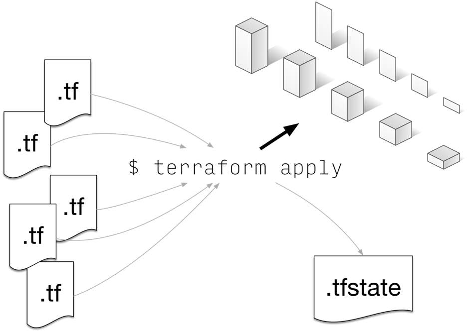
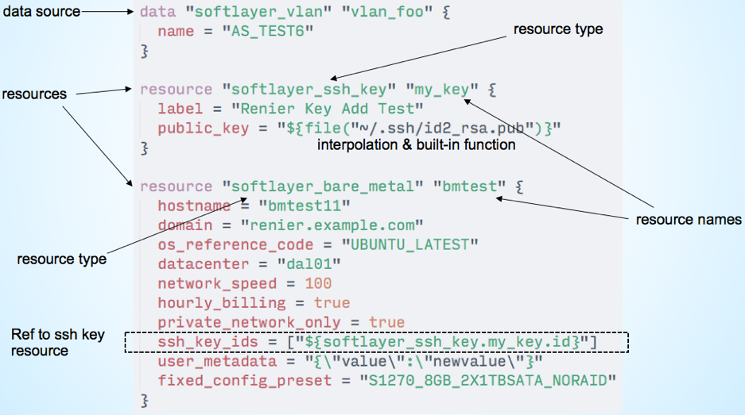
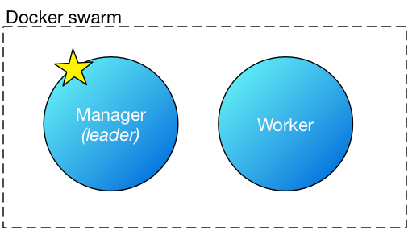
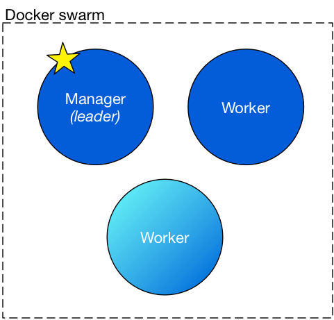
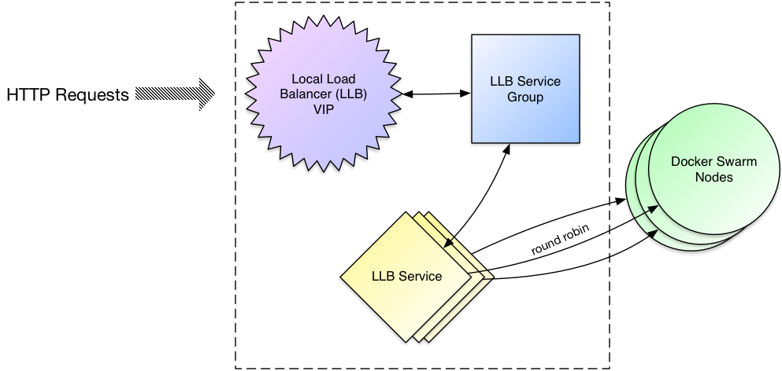

# Automated DevOps environments on Bluemix IaaS using Terraform

## Overview

* Setup
* Quick introduction on Terraform and Terraform-SoftLayer
* Creation of SSH keys on SoftLayer
* Creation of development and production networks
* Deploy a docker swarm
* Add a node to the swarm
* Deploy a load balancer for your swarm
* Store terraform state in object storage

## Setup

Please follow these important setup instructions on your assigned VM:

* Open a terminal (the icon is on the left-hand side after you login). Double-click it. Enter the following:

```
$ cd ~/go/src/github.com/softlayer/terraform-provider-softlayer
$ git pull
$ make bin
```

That will ensure you have the latest version of the code we will use.

Your lab instructor will also provide three important pieces of data:

* A _username_
* An _api key_
* A _datacenter_ name

Use the information above to follow these setup steps:

1. Edit ~/.softlayer and update the `username` with the username provided above.
1. Still in ~/.softlayer, update the `api_key` with the api key provided above.
1. Change to the exercises directory (i.e. `cd exercises`) and update the _vars.tf_ file with the `datacenter` provided above.
1. Also update the `user_string` in _vars.tf_ with your given username **_replacing the underscore with a dash_** (e.g. `ic17-40` instead of `ic17_40`).

From here on out, make sure you stay within the `exercises` directory.

## Introduction

In this lab, we will give a quick tour about automating environments on Bluemix IaaS (formerly SoftLayer – we will use Bluemix IaaS and SoftLayer interchangeably) using Terraform.

Borrowing heavily from its website (terraform.io), Terraform provides a common configuration language to launch infrastructure – from physical and virtual servers, to load balancers and firewalls. Terraform can safely and efficiently change infrastructure as the configuration is evolved. The file-based configuration can give you a simple single view of your entire infrastructure.

Some key features of Terraform are:

* Infrastructure as Code: Infrastructure is designed using a high-level configuration syntax. This allows a blueprint of your datacenter to be versioned and treated as you would any other code. Additionally, infrastructure can be shared and re-used.
* Execution Plans: Terraform has a “planning” step where it generates an _execution plan_. The execution plan shows what Terraform will do when you apply it. This lets you avoid any surprises when Terraform manipulates infrastructure.
* Resource Graph: Terraform builds a graph of all your resources, and parallelizes the creation and modification of any non-dependent resources. Because of this, Terraform builds infrastructure as efficiently as possible, and operators get insight into dependencies in their infrastructure.
* Change Automation: Complex changesets can be applied to your infrastructure with minimal human interaction. With the previously mentioned execution plan and resource graph, you know exactly what Terraform will change and in what order, avoiding potential human errors.

What Terraform is not:

* Not a post-provision tool, even though it can do a hand-off to a post-provision tool like Chef or a simple shell script.
* Not for preventing server configuration drift i.e. does not replace Chef, Salt, Ansible, etc.
* Not for active monitoring of your infrastructure.



**Terraform configuration file:**



* You describe your infrastructure as a set of configuration files.
* Terraform will load all files ending in .tf or .json.tf in the directory where it is invoked. It will append the contents for all configuration files and analyze as one single file.
* The configuration syntax is HCL, compatible with JSON, but easier to read.

Terraform can talk to various cloud platforms of different types. The way it does this is by using plugins called _providers_.

IBM has open-sourced a Terraform _provider_ for SoftLayer (a.k.a Bluemix IaaS). In this lab, we will get familiar with Terraform by using the SoftLayer provider to provision resources on the Cloud.

Currently, Terraform-SoftLayer supports provisioning of around 25 resources. From bare metals and virtual guests, to load balancers and block storage. See the [documentation](../docs) for the full list.

## Lab Exercise: Configure an SSH key

Bluemix IaaS allows you to specify an SSH public key you want installed on newly provisioned VMs. In addition, Terraform can use specified SSH keys to communicate directly with virtual servers for post-provisioning tasks. In this lab, we will create an SSH key pair and upload the public half to SoftLayer.

First, create your SSH keys:

```
$ ssh-keygen -t rsa
```

Follow the prompts, and go with the defaults not specifying a passphrase.

Create the following file called `ssh_key.tf` with the following contents:

```
resource "softlayer_ssh_key" "my_key" {
    label = "${var.user_string}"
    public_key = "${file("~/.ssh/id_rsa.pub")}"
}
```

Now run this through terraform:

```
$ terraform apply
```

You have uploaded your ssh public key to the Cloud!

## Lab Exercise: Configure development and production networks

Development and production environments can be created as separate networks on Bluemix IaaS (a.k.a. SoftLayer). Let’s configure these networks by creating new VLANs.

Create a file, `vlan.tf`, with the following contents:

```
resource "softlayer_vlan" "dev_vlan" {
   name = "dev${var.user_string}"
   datacenter = "${var.datacenter}"
   type = "PRIVATE"
   subnet_size = 32
}

resource "softlayer_vlan" "prd_vlan" {
   name = "prd${var.user_string}"
   datacenter = "${var.datacenter}"
   type = "PRIVATE"
   subnet_size = 32
}
```

Then, `$ terraform apply` to make it so.

## Lab Exercise: Deploy a Docker swarm on your VLAN



Create the following files:

**docker.tf**:
```
resource "softlayer_virtual_guest" "manager" {
    hostname          = "swarm-mgr${var.user_string}"
    domain            = "demo.com"
    os_reference_code = "UBUNTU_LATEST"
    datacenter        = "${var.datacenter}"
    cores             = 1
    memory            = 1024
    local_disk        = false

    ssh_key_ids = [
        "${softlayer_ssh_key.my_key.id}"
    ]

    connection {
        private_key = "${file("~/.ssh/id_rsa")}"
    }

    provisioner "remote-exec" {
        script = "docker.sh"
    }

    provisioner "local-exec" {
        command = "ssh -o StrictHostKeyChecking=no -o UserKnownHostsFile=/dev/null -i ~/.ssh/id_rsa root@${self.ipv4_address} 'docker swarm join-token -q worker' > token.txt"
    }
    
    private_vlan_id = "${softlayer_vlan.dev_vlan.id}"
}

resource "softlayer_virtual_guest" "worker" {
    count             = "${var.worker_count}"
    hostname           = "swarm-wk${var.user_string}-${count.index}"
    domain            = "demo.com"
    os_reference_code = "UBUNTU_LATEST"
    datacenter        = "${var.datacenter}"
    cores             = 1
    memory            = 1024
    local_disk        = false

    ssh_key_ids = [
        "${softlayer_ssh_key.my_key.id}"
    ]

    connection {
        private_key = "${file("~/.ssh/id_rsa")}"
    }

    provisioner "remote-exec" {
        inline = [
            "apt-get update -y > /dev/null",
            "apt-get install docker.io curl -y",
            "curl -L http://bit.ly/2kuCjmp | bash -s",
            "ufw allow 2377/tcp",
            "ufw allow 4789/tcp",
            "ufw allow 7946/tcp",
            "ufw allow 5000/tcp",
            "docker swarm join --token ${trimspace(file("token.txt"))} ${softlayer_virtual_guest.manager.ipv4_address}:2377"
        ]
    }

   private_vlan_id = "${softlayer_vlan.dev_vlan.id}"
}
```

**docker.sh**:
```
#!/bin/sh
apt-get update -y > /dev/null
apt-get install docker.io -y
apt-get install curl -y
curl -L http://bit.ly/2kuCjmp | bash -s
ufw allow 2377/tcp
ufw allow 4789/tcp
ufw allow 7946/tcp
ufw allow 5000/tcp
public_ip=`ifconfig eth1 | grep "inet addr" | cut -d ':' -f 2 | cut -d ' ' -f 1`
docker swarm init --listen-addr $public_ip:2377 --advertise-addr $public_ip
```

Then `$ terraform apply` again.

Enter `$ terraform show`, to see a user-friendly print out of your terraform state showing all the values associated for each provisioned resource. Note the IPs for the swarm manager and worker.

Log into the docker manager and check the swarm status:

```
$ ssh root@<ip of swarm manager>
# docker node ls
```

Download a sample docker image and launch it:

```
$ docker service create --name webapp --replicas 2 -p 5000:5000 training/webapp
```

See that it is running across your Docker swarm:

```
$ docker service ls
$ docker service ps webapp # Wait until current state is 'Running'
```

Now visit it with a web browser at `http://<ip of swarm manager or swarm worker>:5000`. In your terminal, make sure you `exit` the manager node you ssh-ed into, before continuing.

### What about the production environment?

You just provisioned a Docker swarm onto Bluemix IaaS/SoftLayer using a VLAN created for development work. To do the same on your production VLAN, in `docker.tf` you could simply change the VLAN ID property like this `private_vlan_id = "${softlayer_vlan.prd_vlan.id}"`. Note the change in the resource referenced using interpolation which now says `prd_vlan`. We are not doing it in this lab due to time constraints.

## Lab exercise: Add a new worker to your swarm



Open `vars.tf` and update the *worker_count* value to 2.

Run `$ terraform apply` to see it create a new worker node associated to the existing docker swarm.

Log into the docker manager again and check the swarm status. You will see a new worker node added:

```
$ ssh root@<ip of swarm manager>
# docker node ls
```

## Lab exercise: Create a load balancer



A load balancer provides scalability and redundancy for your applications. Let’s create one with a terraform config:

**lb.tf**:
```
resource "softlayer_lb_local" "lb" {
  connections = 250
  datacenter = "${var.datacenter}"
  ha_enabled  = false
  dedicated   = false
}

resource "softlayer_lb_local_service_group" "lb_group" {
  port             = 80
  routing_method   = "CONSISTENT_HASH_IP"
  routing_type     = "HTTP"
  load_balancer_id = "${softlayer_lb_local.lb.id}"
  allocation       = 100
}

resource "softlayer_lb_local_service" "lb_service0" {
  ip_address_id     = "${softlayer_virtual_guest.manager.ip_address_id}"
  port              = 5000
  enabled           = true
  service_group_id  = "${softlayer_lb_local_service_group.lb_group.service_group_id}"
  weight            = 60
  health_check_type = "TCP"
}

resource "softlayer_lb_local_service" "lb_service" {
  count = "${var.worker_count}"
  ip_address_id     = "${element(softlayer_virtual_guest.worker.*.ip_address_id, count.index)}"
  port              = 5000
  enabled           = true
  service_group_id  = "${softlayer_lb_local_service_group.lb_group.service_group_id}"
  weight            = 20
  health_check_type = "TCP"
}
```

Run `$ terraform apply`. This will create a load balancer and configure a load balancer service for the sample application we created in the previous lab.

Use `$ terraform show` to get the IP address of *softlayer_lb_local.lb*.

Now hit that IP address from your browser. This is hitting your load balancer and reaching your docker swarm workers!

## Lab exercise: Remote Terraform State

Whenever you first execute terraform to apply your configuration, it will create a state file after it is done. This state file has information about all resources that were provisioned. Terraform will use this file the next time you apply the configuration, to check for changes and compare against the currently known state of the resources (which it also refreshes from the Cloud at that point). In this manner, it avoids re-provisioning resources that are already provisioned, sees the differences between the known current state and the desired state, and only applies the changes necessary to get to the desired state. After which, it will again save the new state.

The state file can also be stored remotely in object storage and we are going to learn how to do this by performing the following exercise.

This builds on top of any of the previous lab exercises as an existing state file (terraform.tfstate) will be needed. For this lab, we have created an object storage account for you on SoftLayer. Please ask your lab instructor for the complete credentials.

**Object Storage Authentication Endpoint:**
https://s3-api.sjc-us-geo.objectstorage.softlayer.net/

**Access Key ID:** _access key here_

**Secret Access Key:** _secret access key here_

Now, from a directory that has a terraform.tfstate file, do the following:

```
$ terraform remote config -backend=s3 -pull=false \
    -backend-config="bucket=tfstate" \
    -backend-config="key=<your username>" \
    -backend-config="endpoint=https://s3-api.sjc-us-geo.objectstorage.softlayer.net/" \
    -backend-config="access_key=<access key here>" \
    -backend-config="secret_key=<secret key here>" \
    -backend-config="region=us-east-1"

$ terraform remote push
```

In the first step, we configured terraform to store our state file in our object store. In the second step, we told terraform to push our state to the remote store. Now we can collaborate with other DevOps folks on the same configuration since they can further use `terraform remote pull` to pull the latest state changes.

# Completing these exercises later

In order to perform these exercises on your own you need a SoftLayer username and api key. Following are ways to get these, depending on what type of user you are. In addition, you will need to install the [Terraform binary](https://releases.hashicorp.com/terraform/0.8.7/) and the [terraform-provider-softlayer binary](https://github.com/softlayer/terraform-provider-softlayer/releases/tag/v1.4.1) somewhere on your _PATH_.

## Bluemix users

For Bluemix users, you need an upgraded (i.e. paid) Bluemix account. Then you can use [this script](https://softlayer.github.io/rest/IBMidtoSLKey/) to get your SoftLayer username and api key. These go in your `~/.softlayer` file using this format:

```
[softlayer]
username = <your username here>
api_key = <your api key here>
```

## For SoftLayer users

Log on to the [Softlayer portal](https://control.softlayer.com) and then go to [your profile](https://control.softlayer.com/account/user/profile). Your api key (labeled as _Authentication Key_) will be at the bottom. If you can't see it, go to the [users table](https://control.softlayer.com/account/users) and see if you can _generate_ the api key on your user. If you don't see a _generate_ link, then you will have to speak to your SoftLayer account admin to generate it for you.

After you have your API key, Create a `~/.softlayer` file as described above for the bluemix users.

# Copyright

© Copyright IBM Corporation 2017

IBM, the IBM logo and ibm.com are trademarks of International Business Machines Corp., registered in many jurisdictions worldwide. Other product and service names might be trademarks of IBM or other companies. A current list of IBM trademarks is available on the Web at “Copyright and trademark information” at www.ibm.com/legal/copytrade.shtml.

This document is current as of the initial date of publication and may be changed by IBM at any time.

The information contained in these materials is provided for informational purposes only, and is provided AS IS without warranty of any kind, express or implied. IBM shall not be responsible for any damages arising out of the use of, or otherwise related to, these materials. Nothing contained in these materials is intended to, nor shall have the effect of, creating any warranties or representations from IBM or its suppliers or licensors, or altering the terms and conditions of the applicable license agreement governing the use of IBM software. References in these materials to IBM products, programs, or services do not imply that they will be available in all countries in which IBM operates. This information is based on current IBM product plans and strategy, which are subject to change by IBM without notice. Product release dates and/or capabilities referenced in these materials may change at any time at IBM’s sole discretion based on market opportunities or other factors, and are not intended to be a commitment to future product or feature availability in any way.
